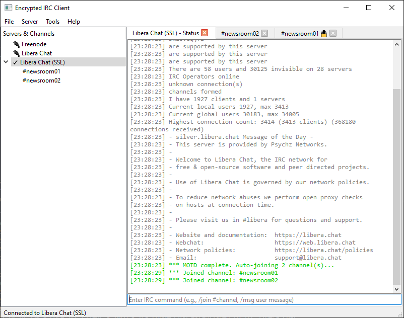

# Encrypted IRC Client

A Windows desktop IRC client featuring per-room and per-PRIVMSG client-side encryption/decryption.



## Features

- **Traditional IRC interface**: Familiar layout with server list, channel windows, nicklist, and status windows
- **Per-room encryption**: Each channel can have a custom encryption key (passphrase) for client-side encryption
- **Multiple server connections**: Connect to multiple IRC servers simultaneously
- **Full IRC protocol support**: JOIN, PART, PRIVMSG, NOTICE, MODE, TOPIC, and more
- **Aliases and commands**: Custom command aliases with variable substitution
- **Message logging**: Automatic logging of channel and private messages
- **Modern UI**: Clean, customizable interface with themes and fonts

## Installation

### Prerequisites

- Python 3.12 or higher
- Windows 10/11

### Setup

1. Install dependencies:
```bash
pip install -r requirements.txt
```

2. Run the application:
```bash
python main.py
```

## Usage

### Connecting to a Server

1. Click **Server** → **Server List** (or press `Ctrl+N`)
2. Click **Add** to create a new server entry
3. Fill in:
   - **Name**: Display name for the server
   - **Hostname**: IRC server address (e.g., `irc.libera.chat`)
   - **Port**: Server port (usually 6667 for non-SSL, 6697 for SSL)
   - **SSL**: Check if the server uses SSL/TLS
   - **Nickname**: Your IRC nickname
   - **Alternative Nick**: Fallback nickname if primary is taken
   - **Username**: IRC username
   - **Realname**: Your real name
   - **Auto-join channels**: Comma-separated list of channels to join automatically
4. Click **OK** and then **Connect**

### Joining a Channel

- Use the `/join #channelname` command in the status window
- Or right-click on a server in the server list and select **Join Channel**

### Setting Up Per-Room Encryption

1. Join a channel
2. Press `Ctrl+K` or right-click the channel tab and select **Set Encryption Key**
3. Enter a passphrase (this must be shared out-of-band with other users)
4. Click **OK**

**Important Notes:**
- The encryption key is stored locally and never transmitted
- Users must share the passphrase manually (via phone, in person, etc.)
- If you forget the key, you cannot decrypt previous messages
- Messages are encrypted before sending to the IRC server
- Users without the key will see encrypted gibberish
- Messages are encrypted using **AES-256-GCM** with a key derived from your passphrase
- Each channel has its own encryption key (or no encryption)

### Commands

Common IRC commands:
- `/join #channel` - Join a channel
- `/part #channel` - Leave a channel
- `/msg nickname message` - Send a private message
- `/nick newnick` - Change your nickname
- `/whois nickname` - Get user information
- `/topic #channel new topic` - Set channel topic
- `/mode #channel +o nickname` - Set channel modes
- `/quit message` - Disconnect with a message

### Aliases

Create custom command aliases in **Tools** → **Aliases**:
- Example: Define `/j` as `/join $1` (where `$1` is the first argument)
- Use `$1`, `$2`, etc. for arguments in your alias definitions

### Logging

Messages are automatically logged to the `logs/` directory, organized by server and channel. Configure logging options in **File** → **Preferences**.

## Architecture

- `main.py` - Application entry point
- `core/` - Core functionality modules
  - `irc_client.py` - IRC connection and protocol handling
  - `irc_parser.py` - IRC message parsing
  - `encryption_manager.py` - Encryption/decryption operations
  - `settings_manager.py` - Settings and database management
  - `alias_manager.py` - Alias expansion and command processing
- `ui/` - User interface components
  - `main_window.py` - Main application window
  - `channel_widget.py` - Channel and PM window widgets
  - `server_list_dialog.py` - Server configuration dialog
  - `room_key_dialog.py` - Encryption key management
  - `preferences_dialog.py` - Application preferences

## Security Considerations

- Encryption keys are derived using PBKDF2-HMAC-SHA256 with 100,000+ iterations
- Keys are stored locally in SQLite (derived keys, not plaintext passphrases)
- The IRC server sees encrypted messages as normal text (it cannot decrypt them)
- Key sharing must be done out-of-band (the application does not provide key exchange)
- If you lose your passphrase, encrypted messages cannot be recovered

## Features Not Included (Yet)

- see Excluded_Features_List.MD

## License

This project is provided as-is for educational and personal use.

